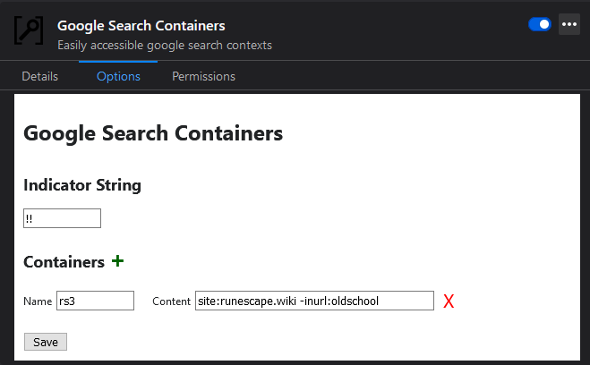

# gsc-plugin
Google Search Containers is a convenience plugin for Firefox that adds the ability to make "containerized" searches in the Google search engine. GSC makes the existing Google search syntax more usable by letting users pre-define commonly-used search contexts.

## What does it do?

GSC lets the user define search contexts that are easily accessible when googling. I'll explain the original use case using own motivation for building this plugin!

I play a game called Runescape which encourages loads of Googling. Since the Runescape community is pretty huge, there are multiple commonly-appearing sources including their main Wiki as well as a Fandom wiki. I prefer my Runescape searches to come from the main Wiki, not the fandom. And I also want information pertaining to the newer version of the game, not the Old School version.

I can define a container using GSC called `rs3` and give it the contents `site:runescape.wiki -inurl:oldschool`. With this container, I will only get results that are from the main Wiki that do not relate to oldschool Runescape.

Using that created container is easy! I simply start my Google search with `!!rs3` to let the GSC plugin know that I want the following search to occur in the `rs3` container.

An example Google query would be something like: `!!rs3 dragons`. Without using GSC, I would have to type "dragons runescape" then scroll through the Google results quickly to find a non-Old School link that isn't from the Fandom Wiki.

## How do I use it?

You can create, modify and delete containers from the GSC options UI located in the built-in extensions management tab in Firefox. This is accessible by visiting `about:addons`, and clicking `Options` within the `Google Search Containers` plugin.

The indicator string (`!!` in the above exmaple) can be changed from the options page to whatever is most comfortable for you to type. This string is used to tell GSC that you want the current search to take place in a container.

Container names cannot currently contain any spaces.

I am very aware that the UI is hot garbage at the moment, but it does the job.

